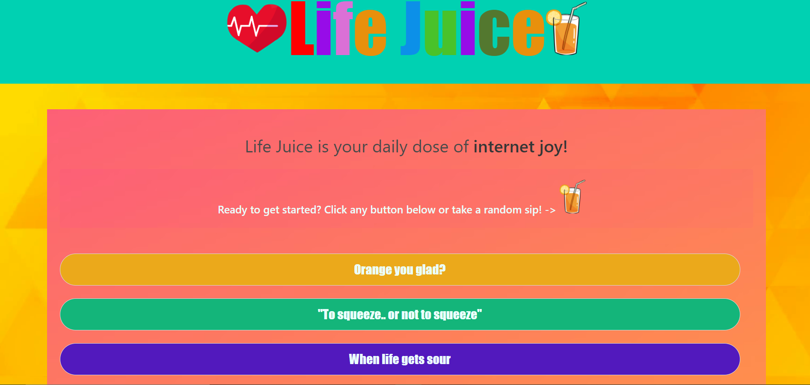

# LifeJuice

If your day is feeling a little dry feel free to take a sip of Life Juice.

https://solemansay.github.io/LifeJuice/

<h2>The big idea</h2>

The goal that we were trying to achive while making Life Juice was to create a UI that when interacted with, would provide the user with joy, wisdom, or a random famous quote. The first thing that we did while drafting our idea was create a couple user stories and make a basic scetch of the site that we wanted. 

- AS a user I want a webpage

- that will provide me with a quote

- SO THAT I can apply the quote to my

- new instagram post.

- GIVEN a screen with button options

- WHEN I select the "quotes" button

- THEN I am presented with an inspirational quote.

-

- AS a user I want a webpage

- that will provide me with a joke

- SO THAT I can have a laugh

- GIVEN a screen with button options

- WHEN I select the "jokes" button

- THEN I am presented with a joke and a few seconds later

- the punch line.

